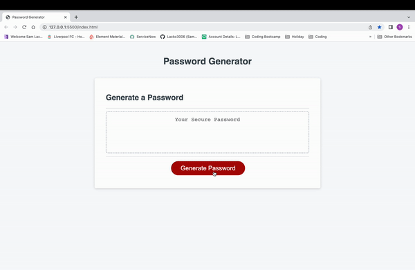

# JavaScript Password enerator

## Description

This web application is my password generator created with HTML, CSS & JavaScript. I have used prompts to select criteria for the generated password and then it is displayed in an alert & to the input box.

This project was build to explore and learn new skills in JavaScript, learning these new skills is key in becoming a web developer and creating properly functioning web applications.

## Mock Up

## Link
https://lacko3006.github.io/javascript-password-generator/